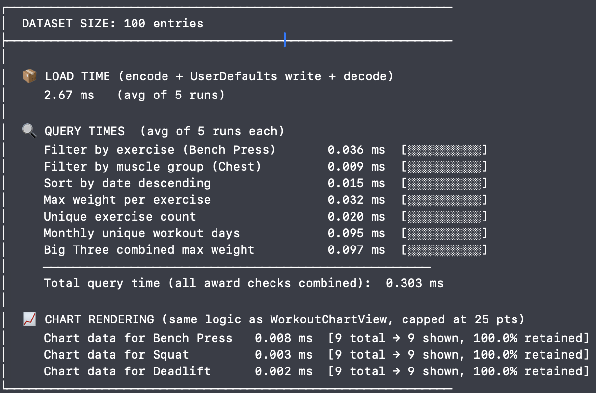

# Experiments

## Experimental Setup

This experiment is tailored specifically to the technical components and development environment used in the WorkoutTracker 
application. Since the project was designed, implemented, and tested entirely within Xcode using the simulator, the experimental 
setup focuses on the conditions required to reproduce the app’s behavior and performance measurements. In order 
to make the results clear and repeatable, this section describes the hardware and software environment, the method used to 
generate the datasets for testing, and the benchmark methodology used to evaluate system performance. Together, these elements 
define the foundation of the experimental process and ensure that the reported results can be understood, replicated, and fairly 
interpreted.

### Hardware and Software Environment

The experiments for this project were conducted on Apple hardware using Xcode and the iPhone Simulator to ensure a consistent and 
reproducible testing environment. The hardware platform used was an Apple MacBook Air equipped with an Apple M4 chip and 16 GB of 
RAM. This machine provided sufficient processing power and memory to build, run, and evaluate the application without hardware-related 
limitations affecting the benchmark results. Rather than deploying to a physical iPhone for the reported experiments, the 
application was executed through the iPhone Simulator included with Xcode, allowing controlled and repeatable testing conditions 
across multiple runs. 

On the software side, the development environment consisted of macOS as the host operating system, Xcode as the integrated 
development environment, Swift as the programming language, and the iOS SDK version bundled with the installed Xcode release. 
Unless otherwise stated, the application was compiled and tested using the Debug build configuration, since this was the 
configuration used during development and simulator-based experimental runs. Recording these hardware and software details is 
important so that another reader or developer can recreate the same setup and reproduce the experimental procedure under 
comparable conditions.

### Dataset Generation

It is important to talk about this data generation as it is the central point of the experiment. This data needed to be created and generated
in the same format as the data the users will enter into the app to simulate real data. By simulating this real data, it will make
this experiment as close to what a user's real app will look like. Being able to simulate the look of real data for this experiment
is important for strengthening my argument and experiment. This synthetic data generation process ensures that the benchmark results 
reflect realistic usage conditions rather than an artificial test environment.

```swift
static let exercises = [
        "Bench Press", "Squat", "Deadlift", "Overhead Press",
        "Pull Up", "Barbell Row", "Leg Press", "Incline Bench",
        "Dumbbell Curl", "Tricep Pushdown", "Lat Pulldown", "Cable Fly"
    ]

    static let muscleGroups = ["Chest", "Back", "Legs", "Arms", 
    "Shoulders", "Core"]
```
\begin{figure}[h!]
\centering
\caption{List of Exercises and Muscle Groups}
\label{fig:workoutcard}
\end{figure}

This is where the data generation starts. The data generation was designed to be simple and efficient. As you can see in the code above,
there is a set list of exercises that the data gets generated from, as well as a set list of muscle groups. When the data is being generated
the loop will cycle through this list of exercises, generating piece by piece in a fashion that equally generates data for each set
exercise. This is also most accurate to what a real user's data might look like. Ideally data should be spread out evenly over different
exercises using different muscle groups. Initializing a set list of exercises makes the data generation easier, as it is just 
assigning a exercise to the piece of data.

Next, it is important to display what this data looks like in the code. Like noted before, the data is built to the same format as the
real data within the app. Like previously mentioned, this will best mirror a user's real data. 

```swift
entries.append(WorkoutEntry(
    date: date,
    muscleGroup: muscleGroup,
    exercise: exercise,
    weight: weight,
    reps: Int.random(in: 3...12)
))
```
\begin{figure}[h!]
\centering
\caption{Data Format and Progression Simulation}
\label{fig:workoutcard}
\end{figure}

This code above is the format for every piece of generated data that this experiment uses. It outlines and uses the same parameters
that the real user data utilizes. Within this code segment you can see that it generates different parameters such as date, muscleGroup,
exercise, weight, and reps. These are all of the important things that the app needs to produce a full and accurate evaluation 
so the user can progress over their time of using the app. By making the data all in the same format, it makes the generation
process super simple and can be done in only a few steps.

### Benchmark Methodology

The benchmark methodology begins by generating synthetic workout data and appending it to the dataset list used by the 
application. This process fills the app with realistic test data before any measurements are taken, ensuring that the benchmark 
reflects how the app performs when it is already populated with entries similar to those a real user would create. For this 
experiment, the dataset size was set to 100, 1000, and 10000 entries so that performance could be observed under a controlled and 
repeatable condition.

Performance was measured in milliseconds to provide precise timing results for each tested operation. Each benchmark test was 
executed 5 times, and the final reported values were calculated as the average of those 5 runs. Averaging the results helped 
reduce the effect of temporary system variation and produced a more reliable representation of the app’s typical performance. As
learned in many classes including data analysis, taking the average of 5 or more runs creates a more accurate depiction of the 
performance. When an experiment is only run once, this contains the possibility of having outliers in your data. By running the
benchmarking experiment multiple times, it allows the times to be much more accurate. 

The benchmark includes three main performance categories: load time, query performance, and chart rendering. Load time measures 
how long the application takes to read and display the stored workout data after launch. Query performance measures how quickly 
the app can search, filter, or retrieve workout-related information from the dataset. Chart rendering measures the time required 
for the app to generate and display visual progress charts based on the stored entries. Together, these three categories provide 
a clear view of the app’s responsiveness and efficiency during its most important functions.

## Experimental Results

In this section, the results of each category will be analyzed and discussed to demonstrate this application’s ability to 
maintain strong performance under high-stress conditions. As this experiment was performed with 3 different dataset sizes, 
this evaluation and analysis is broken into three sections with the corresponding dataset size. By completing this analysis in this
fashion, it will best align with the code output, which will make the analysis much easier.

### Performance Results with 100 Entries



### Performance Results with 1,000 Entries

### Performance Results with 10,000 Entries

### Final Results Evaluation

## Threats to Validity

### Synthetic Data

### Hardware Dependence

### Limited Dataset Sizes


